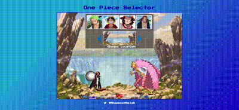

<h1 align="center">One Piece Selector - JavaScript Character Selector | <a href="https://onepiecebattleselector.netlify.app/">Demo</a></h1>

  

<h3 align="center">Let The Battle Begin!</h3>

<h2 align="left">How It's Made:</h2>

Interactive JavaScript application using gifs. Choose which One Piece Character will fight against Doflamingo! I used a carousel for the user to select through the backgrounds.
 

<!--Optimization-->
<h2 align="left">Optimizations</h2>

For the carousel, I could possibly use JavaScript to go ahead and display the battle location a instead of having the user take an extra step in clicking the image.
 

<!--Technologies-->
<h2 align="left">Technologies Used:</h2>

  
  
  

 

<!--What did I learn?-->
<h2 align="left">Lessons Learned:</h2>

Null

<!--Link to my other work/contributions-->
<h2 align="left">Other Projects:</h2>

**Got Cocktail?:** <a href="https://github.com/Primalsia/GotCocktail.github.io">Got Cocktail? Repo</a> 
**Pacific Trails Resort:** <a href="https://github.com/Primalsia/ptresort.github.io">Pacific Trails Resort Repo</a> 
**Portfolio:** <a href="https://github.com/Primalsia/PortfolioWeb2022">Portfolio Repo</a>
